# MaiaSQL

> **Not SQLite compiled to WebAssembly — a browser-native SQL engine designed for the Web.**

MaiaSQL is a SQLite-compatible SQL engine written entirely in JavaScript.

It provides its own lexer, parser, Concrete Syntax Tree (CST), Abstract Syntax Tree (AST), semantic analyzer, execution engine, transaction manager, and storage abstraction. Its default persistent backend is IndexedDB.

The SQL parser is generated by [MaiaCC](https://github.com/souzamonteiro/maiacc), the self-hosted compiler compiler used by the Maia language ecosystem.

MaiaSQL is designed around two public APIs:

1. a modern, Promise-based native API;
2. a WebSQL compatibility API implemented as an adapter over the native API.

This separation allows legacy WebSQL applications to run on MaiaSQL without forcing the core engine to inherit WebSQL's callback-oriented architecture.

---

## Project goals

- Implement a browser-native SQL engine in pure JavaScript.
- Provide broad SQLite syntax and behavioral compatibility.
- Provide a WebSQL-compatible `openDatabase()` API.
- Use IndexedDB as a relational storage backend rather than as a container for SQLite database snapshots.
- Keep parsing, semantic analysis, execution, transactions, and persistence independently testable.
- Expose tokens, CST, AST, query plans, diagnostics, and execution profiles through an optional native introspection API.
- Support future storage backends such as in-memory storage and OPFS without changing the SQL interpreter.
- Remain usable in browsers, Progressive Web Applications, Web Workers, and test environments.

---

## Non-goals

MaiaSQL does not initially aim to provide:

- SQLite binary file compatibility;
- SQLite ABI compatibility;
- a byte-for-byte reimplementation of SQLite;
- synchronous IndexedDB access;
- every SQLite extension in the first release;
- an SQL optimizer comparable to mature native database systems.

The project targets **API and language compatibility where practical**, while preserving a clean JavaScript architecture.

---

## Current status

| Component | Status |
|---|---|
| Case-insensitive SQL lexer | Complete |
| Recursive-descent parser generated by MaiaCC | Complete |
| SQLite-oriented EBNF grammar | Complete |
| CST collection | Complete |
| JSON and XML CST serialization | Complete |
| AST builder | Planned |
| Semantic analyzer | Planned |
| Query planner | Planned |
| SQL executor | Planned |
| Transaction manager | Planned |
| IndexedDB storage engine | Planned |
| Native API | Planned |
| WebSQL compatibility adapter | Planned |

---

# Architecture

## System context

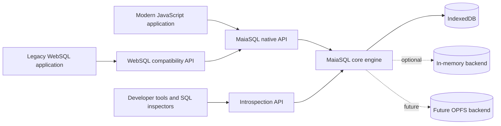
```mermaid
flowchart LR
    LegacyApp[Legacy WebSQL application]
    ModernApp[Modern JavaScript application]
    DevTools[Developer tools and SQL inspectors]

    WebSQLAPI[WebSQL compatibility API]
    NativeAPI[MaiaSQL native API]
    IntrospectionAPI[Introspection API]

    Core[MaiaSQL core engine]
    IndexedDB[(IndexedDB)]
    Memory[(In-memory backend)]
    OPFS[(Future OPFS backend)]

    LegacyApp --> WebSQLAPI
    ModernApp --> NativeAPI
    DevTools --> IntrospectionAPI

    WebSQLAPI --> NativeAPI
    NativeAPI --> Core
    IntrospectionAPI --> Core

    Core --> IndexedDB
    Core -. optional .-> Memory
    Core -. future .-> OPFS
```

The WebSQL adapter is a client of the native API. It does not access the parser, executor, or IndexedDB directly.

---

## Layered architecture

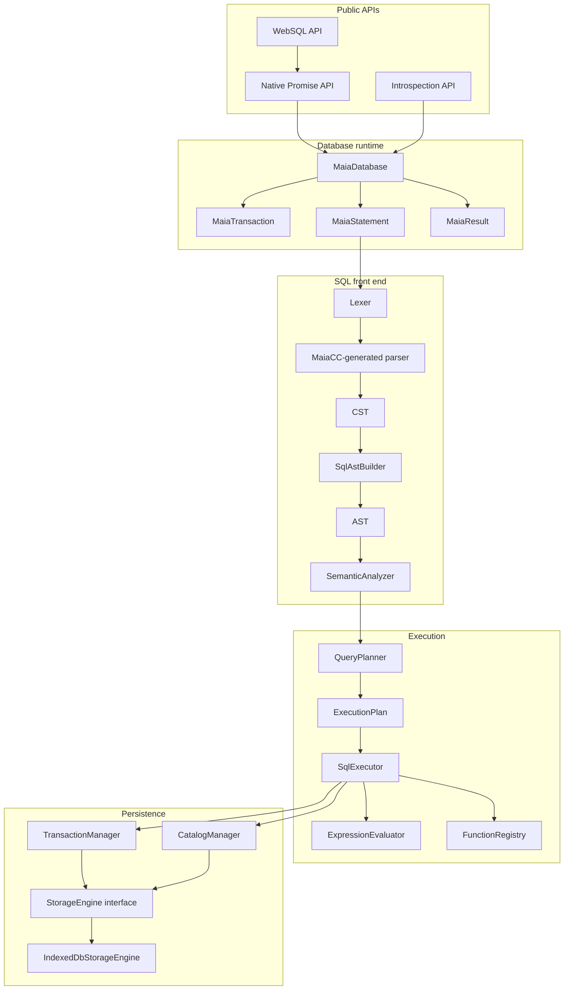
```mermaid
flowchart TB
    subgraph Public_APIs[Public APIs]
        W[WebSQL API]
        N[Native Promise API]
        I[Introspection API]
    end

    subgraph Database_Runtime[Database runtime]
        DB[MaiaDatabase]
        TX[MaiaTransaction]
        STMT[MaiaStatement]
        RESULT[MaiaResult]
    end

    subgraph SQL_Front_End[SQL front end]
        LEX[Lexer]
        PARSER[MaiaCC-generated parser]
        CST[CST]
        ASTB[SqlAstBuilder]
        AST[AST]
        SEM[SemanticAnalyzer]
    end

    subgraph Execution[Execution]
        PLANNER[QueryPlanner]
        PLAN[ExecutionPlan]
        EXEC[SqlExecutor]
        EXPR[ExpressionEvaluator]
        FUNC[FunctionRegistry]
    end

    subgraph Persistence[Persistence]
        TM[TransactionManager]
        CATALOG[CatalogManager]
        STORAGE[StorageEngine interface]
        IDB[IndexedDbStorageEngine]
    end

    W --> N
    N --> DB
    I --> DB

    DB --> TX
    DB --> STMT
    DB --> RESULT

    STMT --> LEX
    LEX --> PARSER
    PARSER --> CST
    CST --> ASTB
    ASTB --> AST
    AST --> SEM
    SEM --> PLANNER
    PLANNER --> PLAN
    PLAN --> EXEC
    EXEC --> EXPR
    EXEC --> FUNC
    EXEC --> TM
    EXEC --> CATALOG
    TM --> STORAGE
    CATALOG --> STORAGE
    STORAGE --> IDB
```

---

## Component diagram


```mermaid
flowchart LR
    subgraph websql[websql]
        OpenDatabase[openDatabase]
        WebSqlDatabase[WebSqlDatabase]
        WebSqlTransaction[WebSqlTransaction]
        WebSqlResultAdapter[WebSqlResultAdapter]
        WebSqlErrorAdapter[WebSqlErrorAdapter]
    end

    subgraph api[api]
        MaiaSQLFacade[MaiaSQL]
        MaiaDatabase[MaiaDatabase]
        MaiaTransaction[MaiaTransaction]
        MaiaStatement[MaiaStatement]
        MaiaResult[MaiaResult]
    end

    subgraph frontend[frontend]
        Lexer[Lexer]
        Parser[Generated Parser]
        Collector[ParseTreeCollector]
        AstBuilder[SqlAstBuilder]
        SemanticAnalyzer[SemanticAnalyzer]
    end

    subgraph planner[planner]
        QueryPlanner[QueryPlanner]
        PlanNodes[Execution plan nodes]
    end

    subgraph executor[executor]
        SqlExecutor[SqlExecutor]
        ExpressionEvaluator[ExpressionEvaluator]
        FunctionRegistry[FunctionRegistry]
        AggregateRegistry[AggregateRegistry]
    end

    subgraph storage[storage]
        StorageEngine[StorageEngine]
        IndexedDbStorageEngine[IndexedDbStorageEngine]
        CatalogManager[CatalogManager]
        TransactionManager[TransactionManager]
        LockManager[DatabaseLockManager]
    end

    OpenDatabase --> WebSqlDatabase
    WebSqlDatabase --> WebSqlTransaction
    WebSqlTransaction --> WebSqlResultAdapter
    WebSqlTransaction --> WebSqlErrorAdapter
    WebSqlDatabase --> MaiaDatabase

    MaiaSQLFacade --> MaiaDatabase
    MaiaDatabase --> MaiaTransaction
    MaiaDatabase --> MaiaStatement
    MaiaStatement --> Lexer
    MaiaStatement --> Parser
    Parser --> Collector
    Collector --> AstBuilder
    AstBuilder --> SemanticAnalyzer
    SemanticAnalyzer --> QueryPlanner
    QueryPlanner --> PlanNodes
    PlanNodes --> SqlExecutor
    SqlExecutor --> ExpressionEvaluator
    SqlExecutor --> FunctionRegistry
    SqlExecutor --> AggregateRegistry
    SqlExecutor --> TransactionManager
    TransactionManager --> StorageEngine
    CatalogManager --> StorageEngine
    StorageEngine --> IndexedDbStorageEngine
    IndexedDbStorageEngine --> LockManager
```

---

# Public API design

## Native API

The native API is asynchronous and Promise-based.

```javascript
const db = await MaiaSQL.open({
  name: "application.db",
  version: 1,
  storage: "indexeddb"
});

await db.exec(`
  CREATE TABLE users (
    id INTEGER PRIMARY KEY AUTOINCREMENT,
    name TEXT NOT NULL
  );
`);

const result = await db.exec(
  "SELECT id, name FROM users WHERE id >= ?",
  [1]
);

console.log(result.rows);
```

The native API is the canonical interface. WebSQL compatibility is built on top of it.

### Proposed native interfaces

```typescript
interface MaiaSQLOpenOptions {
  name: string;
  version?: number;
  storage?: "indexeddb" | "memory";
  readOnly?: boolean;
  pragmas?: Record<string, unknown>;
}

interface MaiaExecOptions {
  transaction?: MaiaTransaction;
  rowMode?: "object" | "array";
  signal?: AbortSignal;
  profile?: boolean;
}

interface MaiaExecutionResult {
  columns: MaiaColumnMetadata[];
  rows: unknown[] | Record<string, unknown>[];
  rowsAffected: number;
  insertId: number | bigint | null;
  statementType: string;
  warnings: MaiaDiagnostic[];
  profile?: MaiaExecutionProfile;
}
```

---

## WebSQL compatibility API

The compatibility layer exposes:

```javascript
const db = openDatabase(
  "application.db",
  "1.0",
  "Application database",
  50 * 1024 * 1024
);

db.transaction(
  function (tx) {
    tx.executeSql(
      "SELECT id, name FROM users WHERE id >= ?",
      [1],
      function (_tx, result) {
        for (let i = 0; i < result.rows.length; i += 1) {
          console.log(result.rows.item(i));
        }
      }
    );
  }
);
```

The adapter must implement:

- `openDatabase()`;
- `Database.transaction()`;
- `Database.readTransaction()`;
- `Database.changeVersion()`;
- `SQLTransaction.executeSql()`;
- `SQLResultSet`;
- `SQLResultSetRowList`;
- `SQLError`;
- transaction success and error callbacks;
- statement-level error callback behavior;
- automatic commit or rollback.

---

# Class model

## End-to-end class diagram

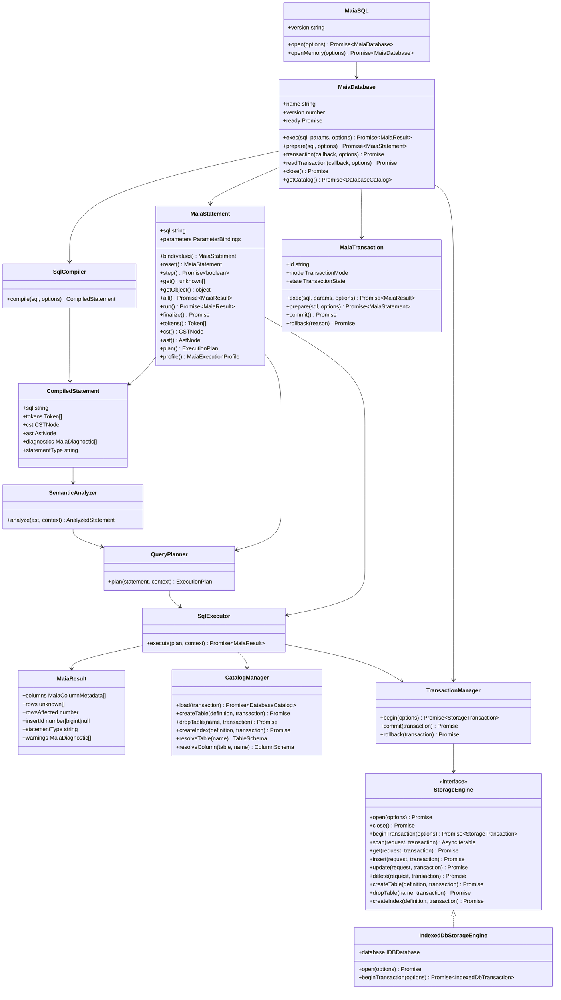
```mermaid
classDiagram
    class MaiaSQL {
        +open(options) Promise~MaiaDatabase~
        +openMemory(options) Promise~MaiaDatabase~
        +version string
    }

    class MaiaDatabase {
        +name string
        +version number
        +ready Promise
        +exec(sql, params, options) Promise~MaiaResult~
        +prepare(sql, options) Promise~MaiaStatement~
        +transaction(callback, options) Promise
        +readTransaction(callback, options) Promise
        +close() Promise
        +getCatalog() Promise~DatabaseCatalog~
    }

    class MaiaStatement {
        +sql string
        +parameters ParameterBindings
        +bind(values) MaiaStatement
        +reset() MaiaStatement
        +step() Promise~boolean~
        +get() unknown[]
        +getObject() object
        +all() Promise~MaiaResult~
        +run() Promise~MaiaResult~
        +finalize() Promise
        +tokens() Token[]
        +cst() CSTNode
        +ast() AstNode
        +plan() ExecutionPlan
        +profile() MaiaExecutionProfile
    }

    class MaiaTransaction {
        +id string
        +mode TransactionMode
        +state TransactionState
        +exec(sql, params, options) Promise~MaiaResult~
        +prepare(sql, options) Promise~MaiaStatement~
        +commit() Promise
        +rollback(reason) Promise
    }

    class MaiaResult {
        +columns MaiaColumnMetadata[]
        +rows unknown[]
        +rowsAffected number
        +insertId number|bigint|null
        +statementType string
        +warnings MaiaDiagnostic[]
    }

    class SqlCompiler {
        +compile(sql, options) CompiledStatement
    }

    class CompiledStatement {
        +sql string
        +tokens Token[]
        +cst CSTNode
        +ast AstNode
        +diagnostics MaiaDiagnostic[]
        +statementType string
    }

    class SemanticAnalyzer {
        +analyze(ast, context) AnalyzedStatement
    }

    class QueryPlanner {
        +plan(statement, context) ExecutionPlan
    }

    class SqlExecutor {
        +execute(plan, context) Promise~MaiaResult~
    }

    class TransactionManager {
        +begin(options) Promise~StorageTransaction~
        +commit(transaction) Promise
        +rollback(transaction) Promise
    }

    class CatalogManager {
        +load(transaction) Promise~DatabaseCatalog~
        +createTable(definition, transaction) Promise
        +dropTable(name, transaction) Promise
        +createIndex(definition, transaction) Promise
        +resolveTable(name) TableSchema
        +resolveColumn(table, name) ColumnSchema
    }

    class StorageEngine {
        <<interface>>
        +open(options) Promise
        +close() Promise
        +beginTransaction(options) Promise~StorageTransaction~
        +scan(request, transaction) AsyncIterable
        +get(request, transaction) Promise
        +insert(request, transaction) Promise
        +update(request, transaction) Promise
        +delete(request, transaction) Promise
        +createTable(definition, transaction) Promise
        +dropTable(name, transaction) Promise
        +createIndex(definition, transaction) Promise
    }

    class IndexedDbStorageEngine {
        +database IDBDatabase
        +open(options) Promise
        +beginTransaction(options) Promise~IndexedDbTransaction~
    }

    MaiaSQL --> MaiaDatabase
    MaiaDatabase --> SqlCompiler
    MaiaDatabase --> MaiaStatement
    MaiaDatabase --> MaiaTransaction
    MaiaDatabase --> TransactionManager
    MaiaStatement --> CompiledStatement
    MaiaStatement --> QueryPlanner
    MaiaStatement --> SqlExecutor
    SqlCompiler --> CompiledStatement
    CompiledStatement --> SemanticAnalyzer
    SemanticAnalyzer --> QueryPlanner
    QueryPlanner --> SqlExecutor
    SqlExecutor --> MaiaResult
    SqlExecutor --> CatalogManager
    SqlExecutor --> TransactionManager
    TransactionManager --> StorageEngine
    StorageEngine <|.. IndexedDbStorageEngine
```

---

## WebSQL adapter class diagram

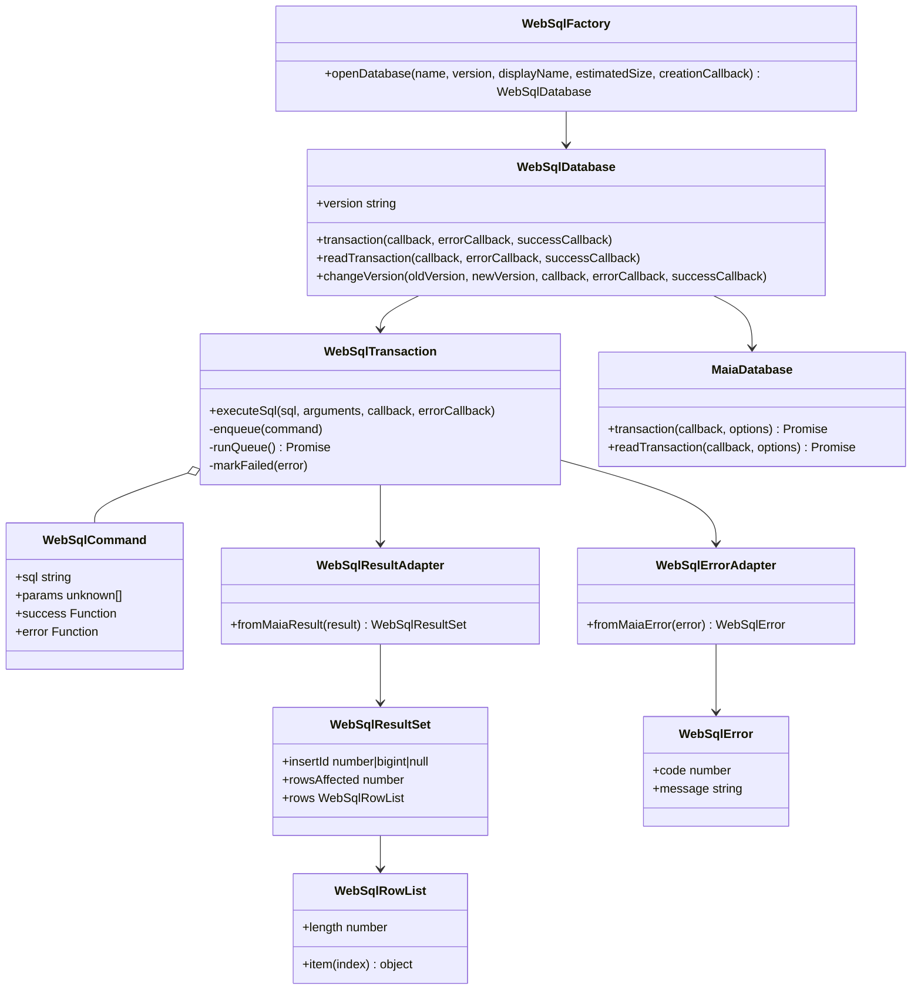
```mermaid
classDiagram
    class WebSqlFactory {
        +openDatabase(name, version, displayName, estimatedSize, creationCallback) WebSqlDatabase
    }

    class WebSqlDatabase {
        +version string
        +transaction(callback, errorCallback, successCallback)
        +readTransaction(callback, errorCallback, successCallback)
        +changeVersion(oldVersion, newVersion, callback, errorCallback, successCallback)
    }

    class WebSqlTransaction {
        +executeSql(sql, arguments, callback, errorCallback)
        -enqueue(command)
        -runQueue() Promise
        -markFailed(error)
    }

    class WebSqlCommand {
        +sql string
        +params unknown[]
        +success Function
        +error Function
    }

    class WebSqlResultSet {
        +insertId number|bigint|null
        +rowsAffected number
        +rows WebSqlRowList
    }

    class WebSqlRowList {
        +length number
        +item(index) object
    }

    class WebSqlError {
        +code number
        +message string
    }

    class WebSqlResultAdapter {
        +fromMaiaResult(result) WebSqlResultSet
    }

    class WebSqlErrorAdapter {
        +fromMaiaError(error) WebSqlError
    }

    class MaiaDatabase {
        +transaction(callback, options) Promise
        +readTransaction(callback, options) Promise
    }

    WebSqlFactory --> WebSqlDatabase
    WebSqlDatabase --> MaiaDatabase
    WebSqlDatabase --> WebSqlTransaction
    WebSqlTransaction o-- WebSqlCommand
    WebSqlTransaction --> WebSqlResultAdapter
    WebSqlTransaction --> WebSqlErrorAdapter
    WebSqlResultAdapter --> WebSqlResultSet
    WebSqlResultSet --> WebSqlRowList
    WebSqlErrorAdapter --> WebSqlError
```

The WebSQL transaction queues `executeSql()` calls synchronously during the transaction callback, then executes the queue asynchronously within one native MaiaSQL transaction.

This design preserves the callback shape of WebSQL while allowing IndexedDB operations to remain asynchronous.

---

## SQL front-end class diagram

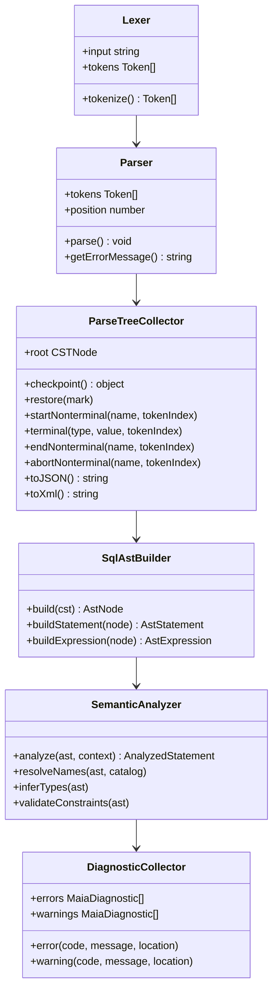
```mermaid
classDiagram
    class Lexer {
        +input string
        +tokens Token[]
        +tokenize() Token[]
    }

    class Parser {
        +tokens Token[]
        +position number
        +parse() void
        +getErrorMessage() string
    }

    class ParseTreeCollector {
        +root CSTNode
        +checkpoint() object
        +restore(mark)
        +startNonterminal(name, tokenIndex)
        +terminal(type, value, tokenIndex)
        +endNonterminal(name, tokenIndex)
        +abortNonterminal(name, tokenIndex)
        +toJSON() string
        +toXml() string
    }

    class SqlAstBuilder {
        +build(cst) AstNode
        +buildStatement(node) AstStatement
        +buildExpression(node) AstExpression
    }

    class SemanticAnalyzer {
        +analyze(ast, context) AnalyzedStatement
        +resolveNames(ast, catalog)
        +inferTypes(ast)
        +validateConstraints(ast)
    }

    class DiagnosticCollector {
        +errors MaiaDiagnostic[]
        +warnings MaiaDiagnostic[]
        +error(code, message, location)
        +warning(code, message, location)
    }

    Lexer --> Parser
    Parser --> ParseTreeCollector
    ParseTreeCollector --> SqlAstBuilder
    SqlAstBuilder --> SemanticAnalyzer
    SemanticAnalyzer --> DiagnosticCollector
```

---

## Execution plan class diagram


```mermaid
classDiagram
    class PlanNode {
        <<abstract>>
        +id string
        +execute(context) AsyncIterable
    }

    class TableScanNode {
        +table string
        +alias string
        +predicate AstExpression
    }

    class IndexScanNode {
        +table string
        +index string
        +range KeyRange
    }

    class FilterNode {
        +predicate AstExpression
    }

    class ProjectionNode {
        +expressions ProjectionItem[]
    }

    class NestedLoopJoinNode {
        +joinType string
        +condition AstExpression
    }

    class AggregateNode {
        +groupExpressions AstExpression[]
        +aggregates AggregateCall[]
    }

    class SortNode {
        +terms OrderingTerm[]
    }

    class LimitNode {
        +limit AstExpression
        +offset AstExpression
    }

    class InsertNode {
        +table string
        +columns string[]
        +source PlanNode
    }

    class UpdateNode {
        +table string
        +assignments Assignment[]
    }

    class DeleteNode {
        +table string
    }

    class DdlNode {
        +operation string
        +definition object
    }

    PlanNode <|-- TableScanNode
    PlanNode <|-- IndexScanNode
    PlanNode <|-- FilterNode
    PlanNode <|-- ProjectionNode
    PlanNode <|-- NestedLoopJoinNode
    PlanNode <|-- AggregateNode
    PlanNode <|-- SortNode
    PlanNode <|-- LimitNode
    PlanNode <|-- InsertNode
    PlanNode <|-- UpdateNode
    PlanNode <|-- DeleteNode
    PlanNode <|-- DdlNode

    FilterNode --> PlanNode : input
    ProjectionNode --> PlanNode : input
    NestedLoopJoinNode --> PlanNode : left
    NestedLoopJoinNode --> PlanNode : right
    AggregateNode --> PlanNode : input
    SortNode --> PlanNode : input
    LimitNode --> PlanNode : input
```

---

## Storage class diagram

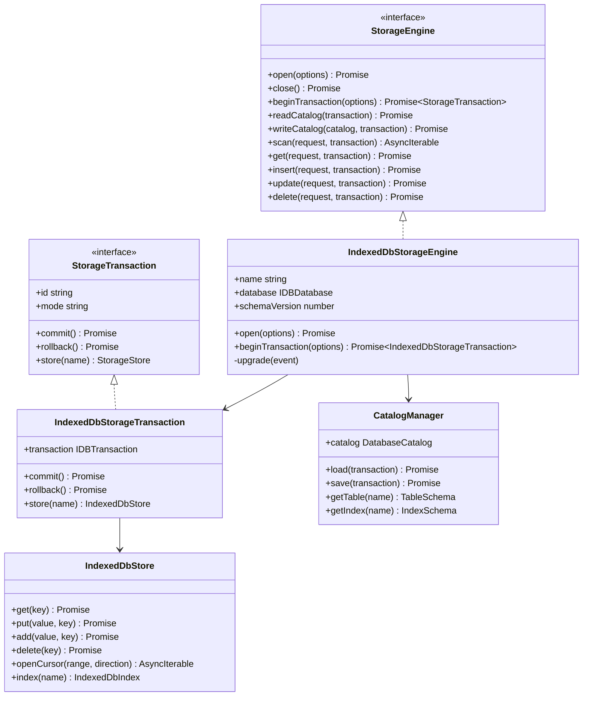
```mermaid
classDiagram
    class StorageEngine {
        <<interface>>
        +open(options) Promise
        +close() Promise
        +beginTransaction(options) Promise~StorageTransaction~
        +readCatalog(transaction) Promise
        +writeCatalog(catalog, transaction) Promise
        +scan(request, transaction) AsyncIterable
        +get(request, transaction) Promise
        +insert(request, transaction) Promise
        +update(request, transaction) Promise
        +delete(request, transaction) Promise
    }

    class StorageTransaction {
        <<interface>>
        +id string
        +mode string
        +commit() Promise
        +rollback() Promise
        +store(name) StorageStore
    }

    class IndexedDbStorageEngine {
        +name string
        +database IDBDatabase
        +schemaVersion number
        +open(options) Promise
        +beginTransaction(options) Promise~IndexedDbStorageTransaction~
        -upgrade(event)
    }

    class IndexedDbStorageTransaction {
        +transaction IDBTransaction
        +commit() Promise
        +rollback() Promise
        +store(name) IndexedDbStore
    }

    class IndexedDbStore {
        +get(key) Promise
        +put(value, key) Promise
        +add(value, key) Promise
        +delete(key) Promise
        +openCursor(range, direction) AsyncIterable
        +index(name) IndexedDbIndex
    }

    class CatalogManager {
        +catalog DatabaseCatalog
        +load(transaction) Promise
        +save(transaction) Promise
        +getTable(name) TableSchema
        +getIndex(name) IndexSchema
    }

    StorageEngine <|.. IndexedDbStorageEngine
    StorageTransaction <|.. IndexedDbStorageTransaction
    IndexedDbStorageEngine --> IndexedDbStorageTransaction
    IndexedDbStorageTransaction --> IndexedDbStore
    IndexedDbStorageEngine --> CatalogManager
```

---

# Core sequences

## Open a database

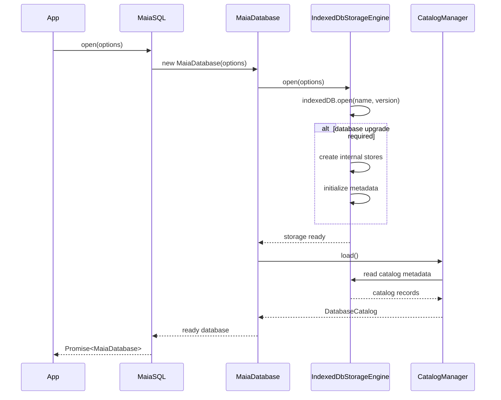
```mermaid
sequenceDiagram
    participant App
    participant MaiaSQL
    participant DB as MaiaDatabase
    participant Storage as IndexedDbStorageEngine
    participant Catalog as CatalogManager

    App->>MaiaSQL: open(options)
    MaiaSQL->>DB: new MaiaDatabase(options)
    DB->>Storage: open(options)
    Storage->>Storage: indexedDB.open(name, version)

    alt database upgrade required
        Storage->>Storage: create internal stores
        Storage->>Storage: initialize metadata
    end

    Storage-->>DB: storage ready
    DB->>Catalog: load()
    Catalog->>Storage: read catalog metadata
    Storage-->>Catalog: catalog records
    Catalog-->>DB: DatabaseCatalog
    DB-->>MaiaSQL: ready database
    MaiaSQL-->>App: Promise<MaiaDatabase>
```

---

## Execute a native SQL statement

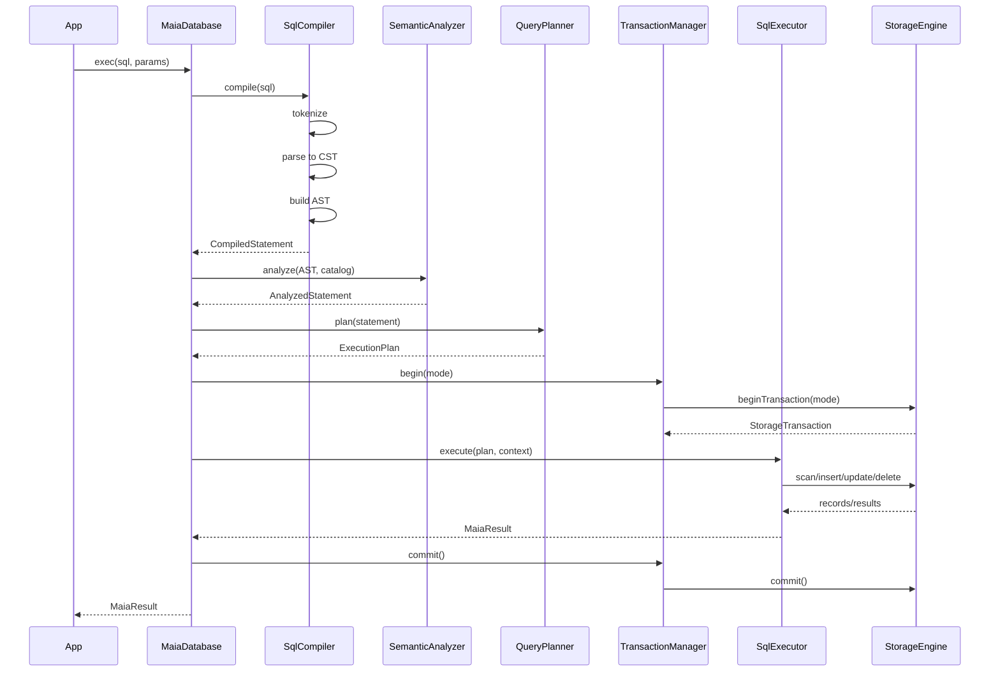
```mermaid
sequenceDiagram
    participant App
    participant DB as MaiaDatabase
    participant Compiler as SqlCompiler
    participant Analyzer as SemanticAnalyzer
    participant Planner as QueryPlanner
    participant TX as TransactionManager
    participant Executor as SqlExecutor
    participant Storage as StorageEngine

    App->>DB: exec(sql, params)
    DB->>Compiler: compile(sql)
    Compiler->>Compiler: tokenize
    Compiler->>Compiler: parse to CST
    Compiler->>Compiler: build AST
    Compiler-->>DB: CompiledStatement

    DB->>Analyzer: analyze(AST, catalog)
    Analyzer-->>DB: AnalyzedStatement
    DB->>Planner: plan(statement)
    Planner-->>DB: ExecutionPlan

    DB->>TX: begin(mode)
    TX->>Storage: beginTransaction(mode)
    Storage-->>TX: StorageTransaction

    DB->>Executor: execute(plan, context)
    Executor->>Storage: scan/insert/update/delete
    Storage-->>Executor: records/results
    Executor-->>DB: MaiaResult

    DB->>TX: commit()
    TX->>Storage: commit()
    DB-->>App: MaiaResult
```

---

## Execute a prepared statement

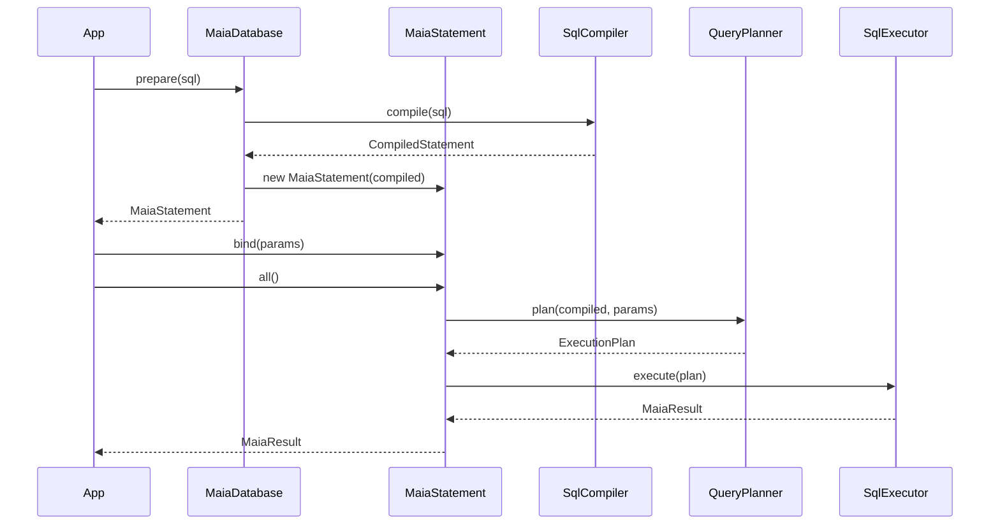
```mermaid
sequenceDiagram
    participant App
    participant DB as MaiaDatabase
    participant Statement as MaiaStatement
    participant Compiler as SqlCompiler
    participant Planner as QueryPlanner
    participant Executor as SqlExecutor

    App->>DB: prepare(sql)
    DB->>Compiler: compile(sql)
    Compiler-->>DB: CompiledStatement
    DB->>Statement: new MaiaStatement(compiled)
    DB-->>App: MaiaStatement

    App->>Statement: bind(params)
    App->>Statement: all()
    Statement->>Planner: plan(compiled, params)
    Planner-->>Statement: ExecutionPlan
    Statement->>Executor: execute(plan)
    Executor-->>Statement: MaiaResult
    Statement-->>App: MaiaResult
```

---

## WebSQL transaction

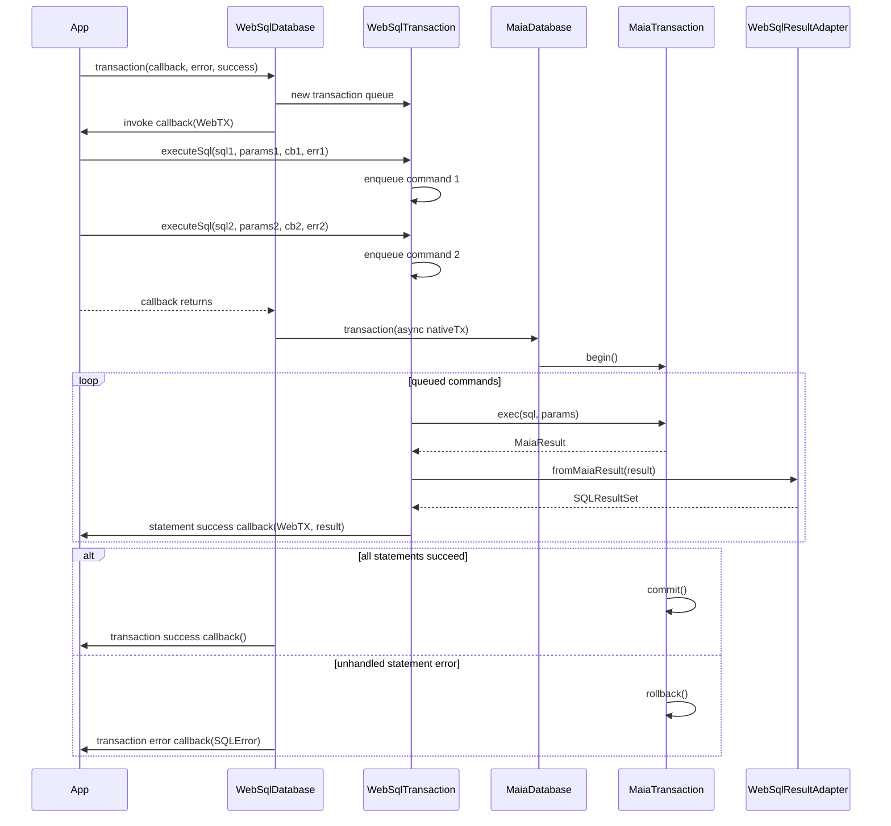
```mermaid
sequenceDiagram
    participant App
    participant WebDB as WebSqlDatabase
    participant WebTX as WebSqlTransaction
    participant MaiaDB as MaiaDatabase
    participant MaiaTX as MaiaTransaction
    participant Adapter as WebSqlResultAdapter

    App->>WebDB: transaction(callback, error, success)
    WebDB->>WebTX: new transaction queue
    WebDB->>App: invoke callback(WebTX)

    App->>WebTX: executeSql(sql1, params1, cb1, err1)
    WebTX->>WebTX: enqueue command 1
    App->>WebTX: executeSql(sql2, params2, cb2, err2)
    WebTX->>WebTX: enqueue command 2
    App-->>WebDB: callback returns

    WebDB->>MaiaDB: transaction(async nativeTx)
    MaiaDB->>MaiaTX: begin()

    loop queued commands
        WebTX->>MaiaTX: exec(sql, params)
        MaiaTX-->>WebTX: MaiaResult
        WebTX->>Adapter: fromMaiaResult(result)
        Adapter-->>WebTX: SQLResultSet
        WebTX->>App: statement success callback(WebTX, result)
    end

    alt all statements succeed
        MaiaTX->>MaiaTX: commit()
        WebDB->>App: transaction success callback()
    else unhandled statement error
        MaiaTX->>MaiaTX: rollback()
        WebDB->>App: transaction error callback(SQLError)
    end
```

### WebSQL statement error behavior

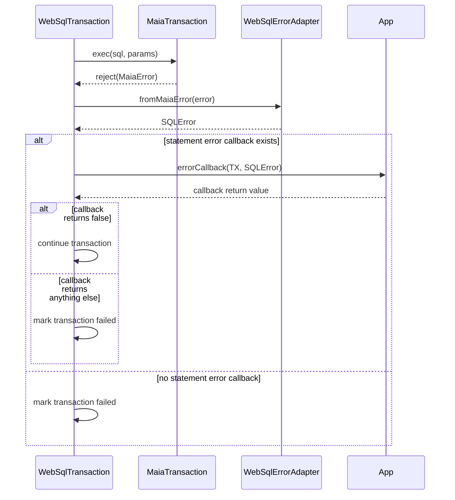
```mermaid
sequenceDiagram
    participant TX as WebSqlTransaction
    participant MaiaTX as MaiaTransaction
    participant ErrorAdapter as WebSqlErrorAdapter
    participant App

    TX->>MaiaTX: exec(sql, params)
    MaiaTX-->>TX: reject(MaiaError)
    TX->>ErrorAdapter: fromMaiaError(error)
    ErrorAdapter-->>TX: SQLError

    alt statement error callback exists
        TX->>App: errorCallback(TX, SQLError)
        App-->>TX: callback return value

        alt callback returns false
            TX->>TX: continue transaction
        else callback returns anything else
            TX->>TX: mark transaction failed
        end
    else no statement error callback
        TX->>TX: mark transaction failed
    end
```

---

## Read transaction

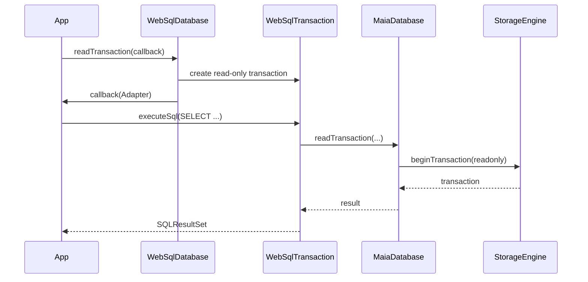
```mermaid
sequenceDiagram
    participant App
    participant DB as WebSqlDatabase
    participant Adapter as WebSqlTransaction
    participant MaiaDB as MaiaDatabase
    participant Storage as StorageEngine

    App->>DB: readTransaction(callback)
    DB->>Adapter: create read-only transaction
    DB->>App: callback(Adapter)
    App->>Adapter: executeSql(SELECT ...)
    Adapter->>MaiaDB: readTransaction(...)
    MaiaDB->>Storage: beginTransaction(readonly)
    Storage-->>MaiaDB: transaction
    MaiaDB-->>Adapter: result
    Adapter-->>App: SQLResultSet
```

---

## Insert execution

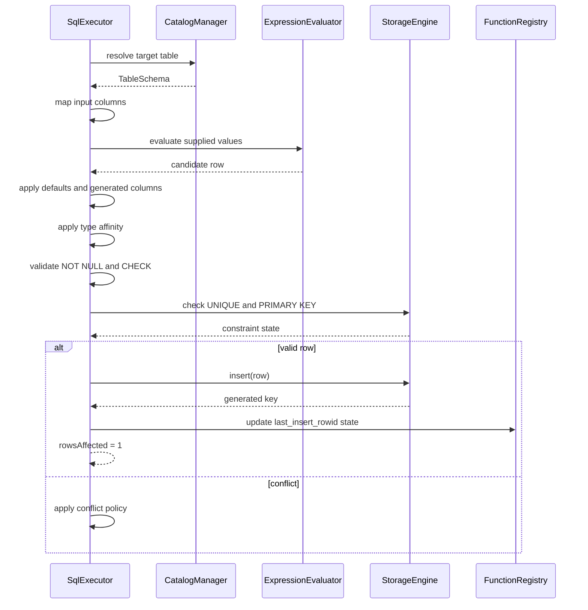
```mermaid
sequenceDiagram
    participant Executor as SqlExecutor
    participant Catalog as CatalogManager
    participant Eval as ExpressionEvaluator
    participant Storage as StorageEngine
    participant Functions as FunctionRegistry

    Executor->>Catalog: resolve target table
    Catalog-->>Executor: TableSchema
    Executor->>Executor: map input columns
    Executor->>Eval: evaluate supplied values
    Eval-->>Executor: candidate row
    Executor->>Executor: apply defaults and generated columns
    Executor->>Executor: apply type affinity
    Executor->>Executor: validate NOT NULL and CHECK
    Executor->>Storage: check UNIQUE and PRIMARY KEY
    Storage-->>Executor: constraint state

    alt valid row
        Executor->>Storage: insert(row)
        Storage-->>Executor: generated key
        Executor->>Functions: update last_insert_rowid state
        Executor-->>Executor: rowsAffected = 1
    else conflict
        Executor->>Executor: apply conflict policy
    end
```

---

## SELECT execution pipeline


```mermaid
flowchart LR
    Scan[Table or index scan]
    Join[Join]
    Where[WHERE filter]
    Group[GROUP BY and aggregates]
    Having[HAVING filter]
    Window[Window functions]
    Project[Projection]
    Distinct[DISTINCT]
    Sort[ORDER BY]
    Limit[LIMIT and OFFSET]
    Result[MaiaResult]

    Scan --> Join
    Join --> Where
    Where --> Group
    Group --> Having
    Having --> Window
    Window --> Project
    Project --> Distinct
    Distinct --> Sort
    Sort --> Limit
    Limit --> Result
```

Not every query uses every stage. The query planner removes unnecessary nodes.

---

# Transaction design

## Native transaction states

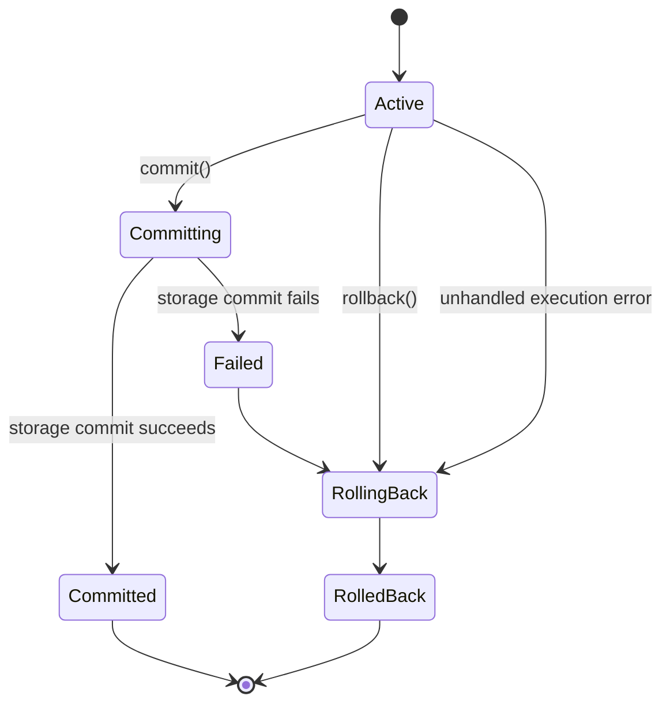
```mermaid
stateDiagram-v2
    [*] --> Active
    Active --> Committing: commit()
    Committing --> Committed: storage commit succeeds
    Committing --> Failed: storage commit fails
    Active --> RollingBack: rollback()
    Active --> RollingBack: unhandled execution error
    RollingBack --> RolledBack
    Failed --> RollingBack
    Committed --> [*]
    RolledBack --> [*]
```

## WebSQL transaction states

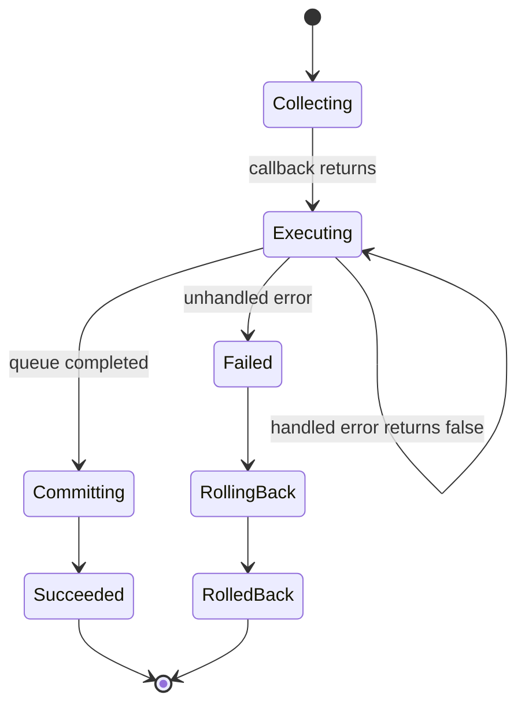
```mermaid
stateDiagram-v2
    [*] --> Collecting
    Collecting --> Executing: callback returns
    Executing --> Executing: statement succeeds
    Executing --> Executing: handled error returns false
    Executing --> Failed: unhandled error
    Executing --> Committing: queue completed
    Committing --> Succeeded
    Failed --> RollingBack
    RollingBack --> RolledBack
    Succeeded --> [*]
    RolledBack --> [*]
```

---

# Catalog model

MaiaSQL maintains a logical catalog independently of IndexedDB's physical schema.

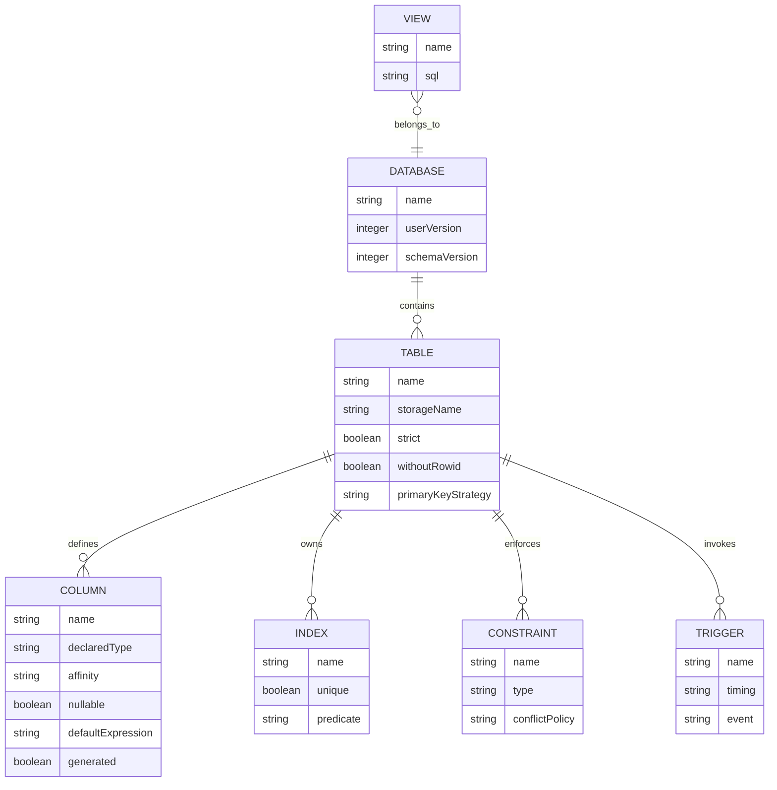
```mermaid
erDiagram
    DATABASE ||--o{ TABLE : contains
    TABLE ||--o{ COLUMN : defines
    TABLE ||--o{ INDEX : owns
    TABLE ||--o{ CONSTRAINT : enforces
    TABLE ||--o{ TRIGGER : invokes
    VIEW }o--|| DATABASE : belongs_to

    DATABASE {
        string name
        integer userVersion
        integer schemaVersion
    }

    TABLE {
        string name
        string storageName
        boolean strict
        boolean withoutRowid
        string primaryKeyStrategy
    }

    COLUMN {
        string name
        string declaredType
        string affinity
        boolean nullable
        string defaultExpression
        boolean generated
    }

    INDEX {
        string name
        boolean unique
        string predicate
    }

    CONSTRAINT {
        string name
        string type
        string conflictPolicy
    }

    TRIGGER {
        string name
        string timing
        string event
    }

    VIEW {
        string name
        string sql
    }
```

The catalog should be versioned and persisted in internal stores such as:

```text
__maiasql_catalog
__maiasql_sequences
__maiasql_metadata
```

User table storage names should not collide with internal stores.

---

# Error model

## Native error hierarchy

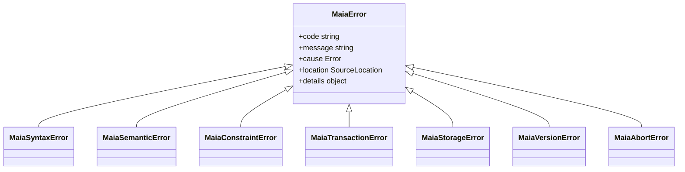
```mermaid
classDiagram
    class MaiaError {
        +code string
        +message string
        +cause Error
        +location SourceLocation
        +details object
    }

    class MaiaSyntaxError
    class MaiaSemanticError
    class MaiaConstraintError
    class MaiaTransactionError
    class MaiaStorageError
    class MaiaVersionError
    class MaiaAbortError

    MaiaError <|-- MaiaSyntaxError
    MaiaError <|-- MaiaSemanticError
    MaiaError <|-- MaiaConstraintError
    MaiaError <|-- MaiaTransactionError
    MaiaError <|-- MaiaStorageError
    MaiaError <|-- MaiaVersionError
    MaiaError <|-- MaiaAbortError
```

## WebSQL error mapping

| MaiaSQL error | WebSQL code |
|---|---:|
| Unknown error | `0` |
| Database or storage error | `1` |
| Version mismatch | `2` |
| Result or statement too large | `3` |
| Quota exceeded | `4` |
| SQL syntax or semantic error | `5` |
| Constraint violation | `6` |
| Timeout or abort | `7` |

The WebSQL adapter is responsible for converting `MaiaError` into an `SQLError`-compatible object.

---

# Proposed project structure

```text
maiasql/
├── README.md
├── LICENSE
├── package.json
├── grammar/
│   ├── SQL.ebnf
│   └── generated/
│       └── parser.js
├── src/
│   ├── api/
│   │   ├── MaiaSQL.js
│   │   ├── MaiaDatabase.js
│   │   ├── MaiaTransaction.js
│   │   ├── MaiaStatement.js
│   │   └── MaiaResult.js
│   ├── websql/
│   │   ├── installWebSqlCompat.js
│   │   ├── WebSqlDatabase.js
│   │   ├── WebSqlTransaction.js
│   │   ├── WebSqlCommand.js
│   │   ├── WebSqlResultAdapter.js
│   │   ├── WebSqlErrorAdapter.js
│   │   └── WebSqlRowList.js
│   ├── frontend/
│   │   ├── SqlCompiler.js
│   │   ├── ParseTreeCollector.js
│   │   ├── SqlAstBuilder.js
│   │   ├── SemanticAnalyzer.js
│   │   └── DiagnosticCollector.js
│   ├── ast/
│   │   ├── statements/
│   │   ├── expressions/
│   │   └── visitors/
│   ├── planner/
│   │   ├── QueryPlanner.js
│   │   ├── ExecutionPlan.js
│   │   └── nodes/
│   ├── executor/
│   │   ├── SqlExecutor.js
│   │   ├── ExpressionEvaluator.js
│   │   ├── FunctionRegistry.js
│   │   ├── AggregateRegistry.js
│   │   └── WindowFunctionRegistry.js
│   ├── catalog/
│   │   ├── CatalogManager.js
│   │   ├── DatabaseCatalog.js
│   │   ├── TableSchema.js
│   │   ├── ColumnSchema.js
│   │   └── IndexSchema.js
│   ├── storage/
│   │   ├── StorageEngine.js
│   │   ├── StorageTransaction.js
│   │   ├── memory/
│   │   │   └── MemoryStorageEngine.js
│   │   └── indexeddb/
│   │       ├── IndexedDbStorageEngine.js
│   │       ├── IndexedDbStorageTransaction.js
│   │       ├── IndexedDbStore.js
│   │       └── DatabaseLockManager.js
│   ├── transactions/
│   │   └── TransactionManager.js
│   ├── errors/
│   │   ├── MaiaError.js
│   │   └── errorCodes.js
│   └── utils/
├── tests/
│   ├── lexer/
│   ├── parser/
│   ├── ast/
│   ├── semantic/
│   ├── planner/
│   ├── executor/
│   ├── storage/
│   ├── websql/
│   └── integration/
├── examples/
└── docs/
```

---

# Implementation order

The first implementation should follow a vertical slice rather than building every subsystem completely.

```mermaid
flowchart LR
    A[1. Native API shell]
    B[2. SqlCompiler and AST]
    C[3. Memory storage engine]
    D[4. CREATE TABLE]
    E[5. INSERT]
    F[6. SELECT table scan]
    G[7. WHERE and expressions]
    H[8. Transactions]
    I[9. IndexedDB backend]
    J[10. WebSQL adapter]
    K[11. UPDATE and DELETE]
    L[12. Indexes and joins]

    A --> B --> C --> D --> E --> F --> G --> H --> I --> J --> K --> L
```

## First usable milestone

The first end-to-end milestone should support:

```sql
CREATE TABLE users (
  id INTEGER PRIMARY KEY AUTOINCREMENT,
  name TEXT NOT NULL
);

INSERT INTO users(name) VALUES (?);

SELECT id, name
FROM users
WHERE id >= ?
ORDER BY id;
```

Through both APIs:

```javascript
const db = await MaiaSQL.openMemory();
await db.exec(...);
```

and:

```javascript
const db = openDatabase(...);
db.transaction(...);
```

A memory backend should be implemented before IndexedDB. This allows the parser, AST builder, semantic analyzer, executor, result model, and WebSQL adapter to be tested without IndexedDB transaction-lifetime constraints.

---

# Testing strategy

```mermaid
flowchart TB
    GrammarTests[Grammar and parser tests]
    AstTests[AST snapshot tests]
    SemanticTests[Semantic validation tests]
    PlannerTests[Plan snapshot tests]
    ExecutorTests[Executor tests with memory storage]
    StorageTests[IndexedDB storage tests]
    WebSQLTests[WebSQL compatibility tests]
    IntegrationTests[End-to-end browser tests]

    GrammarTests --> AstTests
    AstTests --> SemanticTests
    SemanticTests --> PlannerTests
    PlannerTests --> ExecutorTests
    ExecutorTests --> StorageTests
    ExecutorTests --> WebSQLTests
    StorageTests --> IntegrationTests
    WebSQLTests --> IntegrationTests
```

Compatibility tests should verify not only successful queries, but also:

- callback order;
- transaction rollback behavior;
- statement error callback return semantics;
- `rows.length`;
- `rows.item(index)`;
- `rowsAffected`;
- `insertId`;
- database version handling;
- read-only transaction enforcement;
- parameter binding;
- `NULL`, `NaN`, `Date`, blobs, and 64-bit integer behavior.

---

# Introspection API

The native API may expose internal representations without affecting compatibility APIs.

```javascript
const statement = await db.prepare(
  "SELECT id, name FROM users WHERE id >= ?"
);

console.log(statement.tokens());
console.log(statement.cst());
console.log(statement.ast());
console.log(statement.plan());
console.log(statement.profile());
```

This enables:

- SQL teaching tools;
- query-plan visualizers;
- parser diagnostics;
- editor integration;
- syntax highlighting;
- explain tools;
- execution profiling.

---

# Maia ecosystem

MaiaSQL is part of the Maia project family:

- MaiaCC
- MaiaC
- MaiaCpp
- MaiaJS
- MaiaWASM
- MaiaSQL

Its parser is generated from EBNF by MaiaCC, using the same parser-generation infrastructure as the other Maia language projects.

---

# License

MIT
