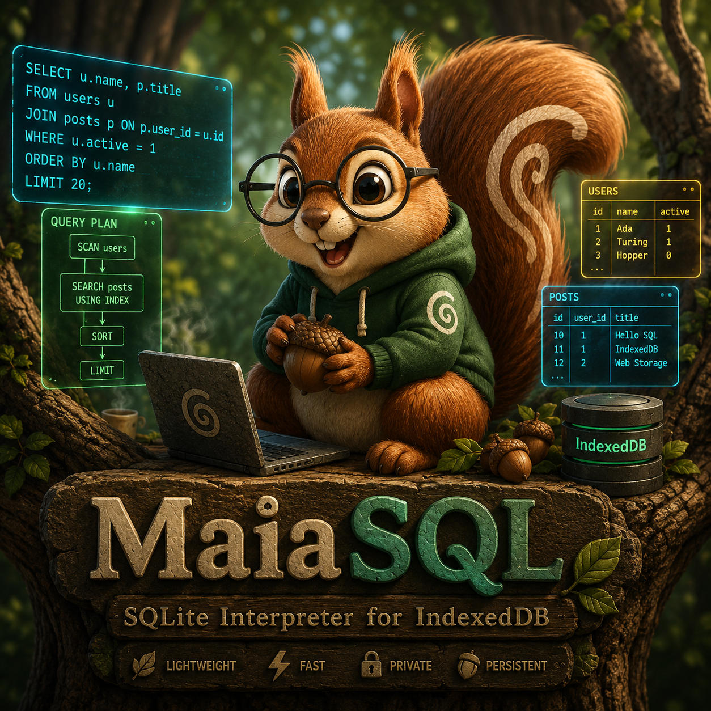

# MaiaSQL (WebSQL)



Pure JavaScript implementation of WebSQL.

## Case-insensitive keywords

Every SQLite keyword is represented by an explicit lexical token built from
short case-insensitive helpers. Bare one-letter helper names collide with the
self-hosted REx lexer, so the grammar uses suffixed helpers. For example:

```ebnf
S_ ::= 'S' | 's'
E_ ::= 'E' | 'e'
L_ ::= 'L' | 'l'
C_ ::= 'C' | 'c'
T_ ::= 'T' | 't'
KW_SELECT ::= S_ E_ L_ E_ C_ T_
```

Syntax productions reference `KW_SELECT` instead of the literal `'SELECT'`.
Consequently, all of these forms are accepted:

```sql
SELECT
select
SeLeCt
```

The current self-hosted tREx path used by this repository rejects equivalence
classes in this grammar, and bare single-letter helper names are tokenized as
character literals. So the grammar uses helpers like `D_ ::= 'D' | 'd'`
instead of `[A-Z] == [a-z]`.

## Files

- `SQL.ebnf`: grammar ready to place in the MaiaSQL `grammar` directory.
- `smoke-tests.sql`: initial uppercase, lowercase and mixed-case parser tests.
- `static-check.json`: structural validation report.

## Start production

```ebnf
SqlScript ::= ';'* (SqlStatement (';'+ SqlStatement)* ';'*)? EOF
```

## Keyword count

148 explicit `KW_*` lexical productions.

## Important design decision

`Name ::= Identifier | Keyword` preserves SQLite's contextual keyword behavior.
The lexer emits keyword tokens before `Identifier`, while syntactic name
positions explicitly accept the `Keyword` production.